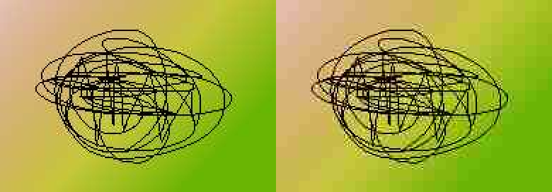
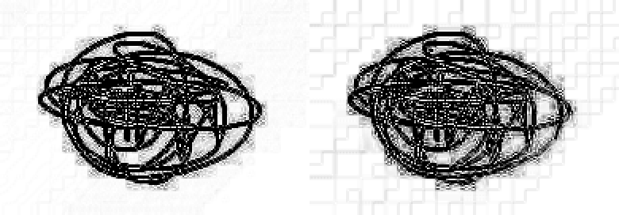
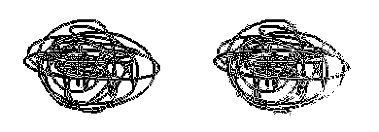
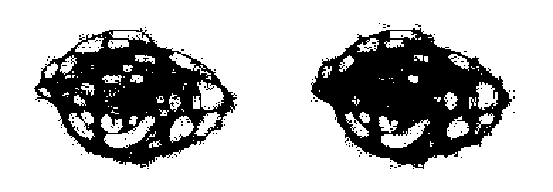
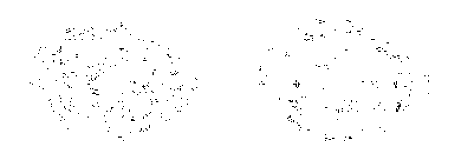

Flood Fill Filter
=================

Русский_

----

 | |Python versions: 3.3 and above| |Build Status| |PyPI|

Summary
-------

The goal is to separate high-density information areas from single-color areas and gradients.
At the same time, JPEG noises with low luminance dispersion should be perceived
as part of these single-color areas and gradients.

I propose a filter based on Flood Fill operation in a local square window with a given width.

The result is a bit like raster methods for edge detection: Sobel, Prewitt, Laplace, Canny operators,
but the meaning is different. Let’s give an example.

|readme_xm|

The Prewitt operator gives the following result.
In this picture, I inverted the intensity; it shows white contours in the original.

|readme_Prewitt_inverted|

Basically, there is nothing to prevent selecting a threshold value, such that there were only contours
without noise. Then there will be a white space between the close lines.

|readme_Prewitt_inverted_contrast|

And the Flood Fill Filter shows the following. The default activation level is 0.45.

|readme_fff|

It paints with black all areas where it is impossible to fill 45% of the 9x9 window around the pixel.
It highlights the noises as well, but most interesting is the following. Let us apply the Flood Fill Filter
to the result of the Flood Fill Filter itself, except with an activation level of 0.05 this time.
This operation will result in the free-standing points detected in the first step.

|readme_fff_fffa005|

Then we exclude all black pixels of the second picture from black pixels of the first picture and
obtain the picture which is the solution to the problem as I understand it.
This result can be obtained with a single command by adding the :code:`--denoise` parameter.

|readme_fff_denoise|

The Flood Fill Filter does not provide a recipe for eliminating noise in photos, but I believe
that this method of separating simple areas of photos from complex ones will be useful in creating
filters that take good care of details in photos.
On its basis, a mask can be created that will protect complex noisy fragments of photos from even
greater distortion as a result of further processing.

*JPEG denoising is a problem for photos only. For illustrations,
an effective denoising method — Bilateral filter
(it is called "Surface blur" in Adobe Photoshop, "Selective Gaussian Blur" in GIMP)
already exists.*

Limitations of the method
-------------------------

1. It will not work automatically if the contrast is increased significantly after JPEG compression.
In this case, the :code:`--diff` parameter should be selected manually (it is :code:`0.08` by default)

2. The filter requires hundreds of times more computing resources than the Prewitt operator
and the most other convolution-based filters.

Installation
------------

.. code-block:: bash

    pip install flood-fill-filter

    # or all user installation:
    sudo python3 -m pip install --prefix /usr/local flood-fill-filter

Usage
-----

From command line:

.. code-block:: bash

    flood_fill_filter input.jpg output.png

    flood_fill_filter --help

From code:

.. code-block:: python

    import flood_fill_filter.flood as flood

    input = flood.read_linear(filename)
    result = flood.filter(input)            # Two-dimensional NumPy array.

    flood.save(
        flood.to_8_bit(result * 255),
        output_filename
    )

Technical details
-----------------

First, the image is translated to the CIE XYZ color space.

Gamma correction is applied for the luminance component Y.
Let's call the corrected value Yγ.

Yγ above 0.7 is corrected so that the white color becomes equal to 0.75.

Let's call the resulting value L.

.. code-block::

    L = Yγ - Yγ * 0.25 * ((Yγ - 0.7) / (1 - 0.7)), Yγ > 0.7
    L = Yγ, Yγ ⩽ 0.7

The :code:`--diff` parameter determines the minimum difference between L₁ и L₂,
at which we stop considering the luminance to be the same.
That is, with the standard settings, light gray 0.7 and white are considered the same color.

This is a hack that allows ignoring white halos around objects.
They can appear in the photo initially or after the Unsharp Mask filter.

The differences of the chromaticity components X and Z are taken into account 4 times weaker
than the luminance. This means that at the same luminance, we consider the colors to be the same
only if both X and Z components differ by less than :code:`4 * diff`.

When luminance is above 0.5, the X and Z sensitivity threshold expands to :code:`8 * diff`.

In pixels close to black, the X and Z components are ignored — that is, at the same luminance,
we consider the colors to be the same.

Each pixel is filled in four directions: horizontally and vertically, but not diagonally.

Pixels in the fill process are compared to the fill start point, not to the adjacent pixels.

.. |Build Status| image:: https://travis-ci.org/georgy7/flood_fill_filter.svg?branch=master
   :target: https://travis-ci.org/georgy7/flood_fill_filter
.. |PyPI| image:: https://img.shields.io/pypi/v/flood-fill-filter.svg
   :target: https://pypi.org/project/flood-fill-filter/

.. |Python versions: 3.3 and above| image:: https://img.shields.io/pypi/pyversions/flood_fill_filter.svg?style=flat

.. _Русский: https://github.com/georgy7/flood_fill_filter/blob/master/README_ru.rst
