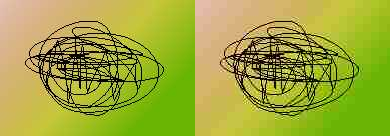
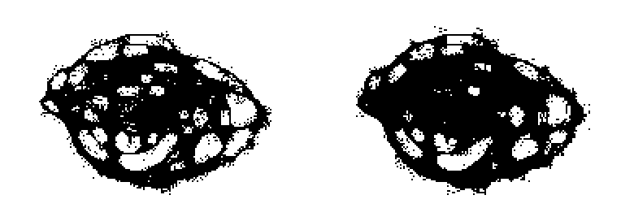

Flood Fill Filter или заливочный фильтр
=======================================

English_

----

 | |Python versions: 3.3 and above| |Build Status| |PyPI|

Краткое описание
-----------------

Цель — отделить участки с большой плотностью информации от однотонных областей и градиентов.
При этом JPEG-шумы с небольшим разбросом яркости должны восприниматься как часть этих однотонных областей и градиентов.

Я предлагаю фильтр на базе операции заливки внутри локального квадратного окна с заданной шириной.

Результат немного похож на растровые методы нахождения границ: операторы Собела, Прюитта, Лапласа, Кэнни,
но смысл другой. Приведу пример.

|readme_xm|

Оператор Прюитта даёт такой результат.
Здесь я инвертировал яркость, в оригинале он показывает белым цветом контуры.

|readme_Prewitt_inverted|

В принципе, ничто не мешает подобрать пороговое значение, чтобы остались только контуры
без шумов. Тогда между близко расположенными линиями будет белое пространство.

|readme_Prewitt_inverted_contrast|

А вот что показывает заливочный фильтр. Уровень активации по-умолчанию — 0,45.

|readme_fff|

Он закрашивает черным все места, где не получается залить 45% площади окна 9x9 вокруг пикселя.
Шумы он тоже подсвечивает, но дальше самое интересное.
Применим заливочный фильтр к результату самого заливочного фильтра, но теперь уже с уровнем активации 0,05.
Результатом этой операции будут отдельно стоящие точки, детектированные на первом шаге.

|readme_fff_fffa005|

Затем исключим из черных пикселей первой картинки все черные пиксели второй картинки и получится картинка,
которая и является решением задачи, как я ее понимаю.
Такой результат можно получить одной командой, добавив параметр :code:`--denoise`.

|readme_fff_denoise|

Flood Fill Filter не даёт готового рецепта по устранению шумов на фотографиях,
но я верю, что этот метод отделения легких участков фотографий от сложных будет полезен в создании фильтров,
которые бережно относятся к деталям на фотографиях. На его базе можно сделать маску, которая защитит
сложные зашумлённые фрагменты фото от еще больших искажений в результате дальнейшей обработки.

*Очистка от JPEG-шумов — проблема только для фотографий.
Для иллюстраций уже существует эффективный способ очистки — Bilateral filter
(он называется «Surface blur» в Adobe Photoshop, «Selective Gaussian Blur» в GIMP).*

Недостатки метода
-----------------

Он не сработает автоматически, если сильно увеличить контрастность после JPEG-сжатия.
В этом случае придётся вручную подбирать параметр :code:`--diff` (по-умолчанию :code:`0.08`).

Установка
---------

.. code-block:: bash

    pip install flood-fill-filter

    # Или для всех пользователей:
    sudo python3 -m pip install --prefix /usr/local flood-fill-filter

Использование
-------------

Из командной строки:

.. code-block:: bash

    flood_fill_filter input.jpg output.png

    flood_fill_filter --help

Из кода:

.. code-block:: python

    import flood_fill_filter.flood as flood

    input = flood.read_linear(filename)
    result = flood.filter(input)            # Двумерный NumPy массив.

    flood.save(
        flood.to_8_bit(result * 255),
        output_filename
    )

Технические детали
------------------

Вначале изображение переводится в цветовое пространство CIE XYZ.

Делается гамма-коррекция на яркостной компоненте Y.
Назовём скорректированное значение Yγ.

Yγ выше 0,7 корректируется таким образом, что белый цвет становится равен 0,75.

Назовём полученное значение L.

.. code-block::

    L = Yγ - Yγ * 0.25 * ((Yγ - 0.7) / (1 - 0.7)), Yγ > 0.7
    L = Yγ, Yγ ⩽ 0.7

Параметр :code:`--diff` определяет минимальную разницу между L₁ и L₂,
при которой мы перестаём считать яркость одинаковой.
То есть на стандартных настройках светло-серый 0,7 и белый считаются одним и тем же цветом.

Это хак, позволяющий игнорировать белые ореолы вокруг объектов.
Они могут быть на фото изначально или появиться после фильтра Unsharp Mask.

Разница в цветоразностных компонентах X и Z учитывается в 4 раза слабее, чем яркость.
Это значит, что при одинаковой яркости, мы считаем цвета одинаковыми, только если
обе компоненты X и Z различаются меньше чем на :code:`4 * diff`.

При яркости выше 0,5, порог чувствительности X и Z расширяется до :code:`8 * diff`.

У пикселей, близких к черному цвету, компоненты X и Z игнорируются —
т.е. при одинаковой яркости считаем цвета одинаковыми.

Заливка из каждого пикселя производится по четырём направлениям: по горизонтали и по вертикали, но не по диагонали.

Пиксели с процессе заливки сравниваются с точкой начала заливки, а не со смежными пикселями.

См. также
---------

`fffd
<https://github.com/georgy7/fffd>`_

.. |Build Status| image:: https://travis-ci.org/georgy7/flood_fill_filter.svg?branch=master
   :target: https://travis-ci.org/georgy7/flood_fill_filter
.. |PyPI| image:: https://img.shields.io/pypi/v/flood-fill-filter.svg
   :target: https://pypi.org/project/flood-fill-filter/

.. |readme_Prewitt_inverted| image:: samples3/readme_Prewitt_inverted.png

.. |readme_Prewitt_inverted_contrast| image:: samples3/readme_Prewitt_inverted_contrast.png

.. |readme_fff_fffa005| image:: samples3/readme_fff_fffa005.png

.. |Python versions: 3.3 and above| image:: https://img.shields.io/pypi/pyversions/flood_fill_filter.svg?style=flat

.. _English: https://github.com/georgy7/flood_fill_filter/blob/master/README.rst
